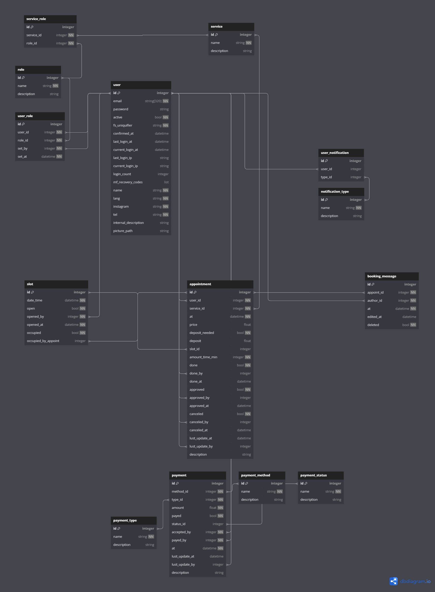

# Database schema

Here is a description of db_v2.db



[diagram online editor](https://dbdiagram.io/d/project-65da6aad5cd0412774bb423c)

```
Table appointment {
  id integer [primary key]
  user_id integer [not null, ref: <> user.id]
  service_id integer [not null, ref: <> service.id]
  at datetime [not null]
  price float 
  deposit_needed bool [not null, default: false]
  deposit float
  slot_id integer [ref: <> slot.id]
  amount_time_min integer [not null, default: 90]
  done bool [not null, default: false]
  done_by integer [ref: <> user.id] 
  done_at datetime 
  approved bool [not null, default: false]
  approved_by integer [ref: <> user.id]
  approved_at datetime 
  canceled bool [not null, default: false]
  canceled_by integer [ref: <> user.id]
  canceled_at datetime
  lust_update_at datetime
  lust_update_by integer [ref: <> user.id]
  description string
}

Table booking_message {
  id integer [primary key]
  appoint_id integer [not null, ref: <> appointment.id]
  author_id integer [not null, ref: <> user.id]
  at datetime [not null]
  edited_at datetime
  deleted bool [not null, default: false]
}

Table language {
  id integer [primary key]
  name string [not null, unique]
  description string
}

Table    { #######
  id integer [primary key]
  name string [not null, unique]
  description string
  user_id integer
  user object
}

Table notification_type {
  id integer [primary key]
  name string [not null, unique]
  description string
}

Table payment {
  id integer [primary key]
  method_id integer [not null, ref: <> payment_method.id]
  type_id integer [not null, ref: <> payment_type.id]
  amount float [not null]
  payed bool [not null, default: false]
  status_id integer [ref: <> payment_status.id]     ### not null
  accepted_by integer [not null, ref: <> user.id]
  payed_by integer [not null, ref: <> user.id]
  at datetime [not null]
  lust_update_at datetime                           ### nullable
  lust_update_by integer [ref: <> user.id]
  description string
}

Table payment_method {
  id integer [primary key]
  name string [not null, unique]
  description string
}

Table payment_status {
  id integer [primary key]
  name string [not null, unique]
  description string
}

Table payment_type {
  id integer [primary key]
  name string [not null, unique]
  description string
}

Table role {
  id integer [primary key]
  name string [not null, unique]
  description string
}

Table service {
  id integer [primary key]
  name string [not null, unique]
  description string
}

Table service_role {
  id integer [primary key]
  service_id integer [not null, ref: <> service.id]
  role_id integer [not null, ref: <> role.id]
}

Table slot {
  id integer [primary key] 
  date_time datetime [not null]
  opened bool [not null, default: false] #############
  opened_by integer [not null, ref: <> user.id]
  opened_at datetime [not null]
  occupied bool [not null, default: false]
  occupied_by_appoint integer [ref: <> appointment.id] ### not null
}

Table user {
  id integer [primary key] 
  email string [not null, unique] ###
  password string
  active bool [not null, default: false]
  fs_uniquifier string [not null, unique, note: "64 bytes"] 
  confirmed_at datetime
  last_login_at datetime
  current_login_at datetime
  last_login_ip string
  current_login_ip string
  login_count integer
  mf_recovery_codes list
  name string [not null]  
  instagram string [not null]
  tel string [not null]
  language_id integer [ref: <> language.id]
  internal_description string
  picture_path string
  lust_update_at datetime
  lust_update_by integer [ref: <> user.id]
      deleted: sa.orm.Mapped[bool] = sa.orm.mapped_column(nullable = False, default = False)
    deleted_at: sa.orm.Mapped[datetime.datetime] = sa.orm.mapped_column(nullable = True) 
    deleted_by: sa.orm.Mapped[int] = sa.orm.mapped_column(nullable = True)
}

Table user_notification {
  id integer [primary key]
  user_id integer [ref: <> user.id]
  type_id integer [ref: <> notification_type.id]
}

Table user_role {
  id integer [primary key]
  user_id integer [not null, ref: <> user.id]
  role_id integer [not null, ref: <> role.id]
  set_by integer [not null, ref: <> user.id]
  set_at datetime [not null]
}
```